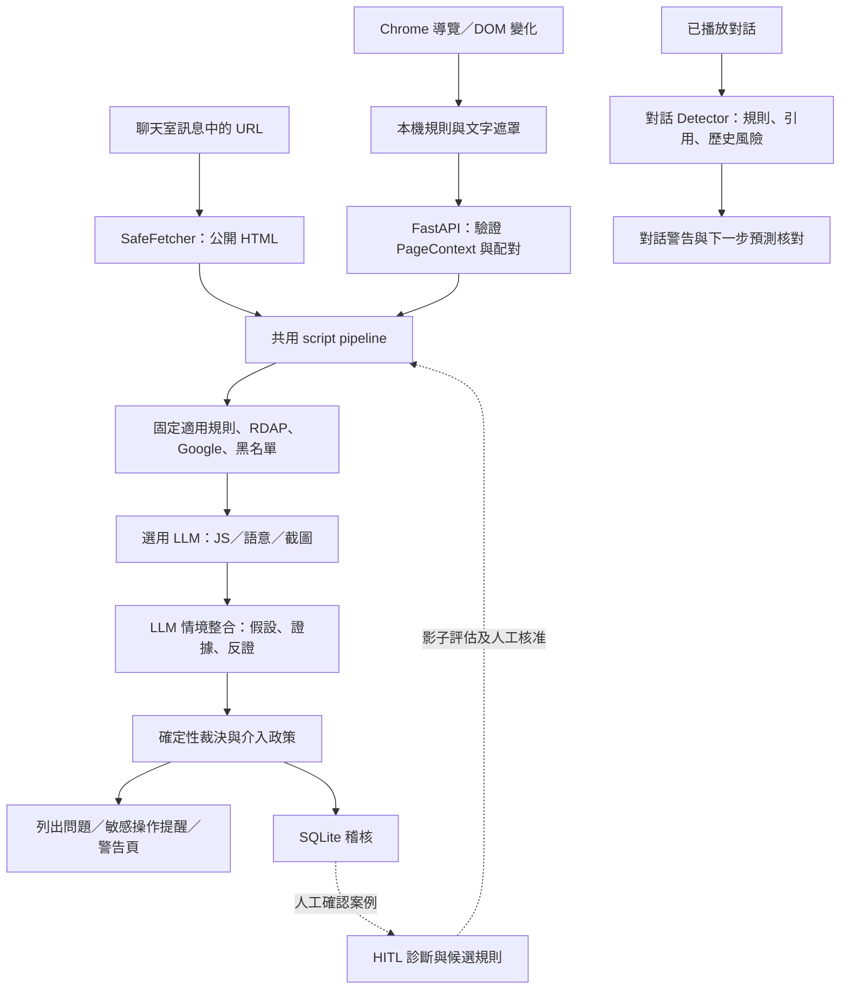

# 防詐雷達 Anti-Scam Radar

防詐雷達是一個黑客松專案，結合 **Chrome 擴充功能、本機 Python 驗證服務、LLM 情境判斷與聊天室 demo**。它會檢查網址、網站自稱身分、話術、表單與程式碼等線索，在可疑操作前提醒使用者，並保留判斷理由與未取得的資料。

LLM 負責理解語意、比較正常與詐騙解釋，以及提出補查或改善候選；程式負責資料邊界、證據驗證、風險聚合與介入門檻。**未命中規則、Google 未列入威脅資料、或某層沒有資料，都不代表網站安全。**

## 目錄

- [快速開始](#快速開始)
- [API key 與設定](#api-key-與設定)
- [使用 Chrome 擴充功能](#使用-chrome-擴充功能)
- [聊天室與展示案例](#聊天室與展示案例)
- [CLI 與 Python 使用方式](#cli-與-python-使用方式)
- [HTTP API](#http-api)
- [邏輯架構與判斷流程](#邏輯架構與判斷流程)
- [LLM 自適應與 HITL](#llm-自適應與-hitl)
- [資料與隱私範圍](#資料與隱私範圍)
- [本機 RAG 模組](#本機-rag-模組)
- [測試、CI 與維護](#測試ci-與維護)
- [常見問題](#常見問題)
- [目錄與延伸文件](#目錄與延伸文件)

## 快速開始

### 1. 準備環境

| 工具 | 用途／版本 |
|---|---|
| Git | 取得與管理程式碼 |
| Python 3.12 | 與 CI 使用版本一致，可由 uv 管理 |
| [uv](https://docs.astral.sh/uv/getting-started/installation/) | 安裝鎖定的 Python 依賴 |
| Node.js 22 與 npm | 與 CI 一致，用於前端建置與測試 |
| Chrome 120 以上 | 載入 Manifest V3 擴充功能 |

除特別註明外，下列指令都在**儲存庫根目錄**執行。

```bash
git clone https://github.com/cheat-or-chicken/Anti-Scam-radar.git
cd Anti-Scam-radar
uv sync --locked --python 3.12 --extra dev
npm ci --prefix extension
npm run build --prefix extension
```

### 2. 建立本機設定

第一次使用時，從範本建立設定檔；已存在的設定不需要重新複製。

```bash
uv run python -c "from pathlib import Path; p=Path('config/config.local.json'); p.exists() or p.write_text(Path('config/config.example.json').read_text(encoding='utf-8'), encoding='utf-8')"
```

用編輯器開啟 `config/config.local.json`，填入 OpenAI 與 Google key，詳見[設定說明](#api-key-與設定)。此檔案已被 Git 忽略。

**範本目前預設允許 LLM、內容上傳與連網。** 沒有 key 時不會取得完整 AI／Google 查核結果。如果只想使用離線規則，請依下節關閉相關設定。

### 3. 啟動網站分析後端

```bash
uv run python -m script.server
```

服務在 [http://127.0.0.1:8765/health](http://127.0.0.1:8765/health)，終端會顯示啟動資訊；log 預設寫入 `var/backend.log`。首次啟動會產生 **`var/extension-token.txt` 本機配對碼**。

### 4. 載入 Chrome 擴充功能

1. 在 Chrome 網址列輸入 `chrome://extensions`。
2. 開啟「開發人員模式」，點選「載入未封裝項目」。
3. 選取本專案的 **`extension` 資料夾**。
4. 進入擴充功能設定，確認本機後端與 AI 開關。
5. 將 `var/extension-token.txt` 的內容貼入「配對碼」，按連線測試並儲存。
6. 重新整理原本開著的網頁，讓內容偵測開始運作。

**配對碼不是 OpenAI API key。不要把供應商 key 貼進擴充功能。**

只載入擴充功能、未啟動後端時，仍可執行本機網址／文案／表單規則；進階後端結果會顯示不可用。

### 5. 跑 demo

另開終端啟動五種展示網站：

```bash
uv run python -m script.demo_server
```

開啟 [http://127.0.0.1:8088/](http://127.0.0.1:8088/)。聊天室是另一個服務：

```bash
uv run python -m ChatRoom.server
```

開啟 [http://127.0.0.1:8000/](http://127.0.0.1:8000/)，選案例後按「下一則」或「自動重播」。

| 服務 | 預設位置 | 何時需要 |
|---|---|---|
| 網站分析 API | `127.0.0.1:8765` | 擴充功能進階分析 |
| 聊天室 demo | `127.0.0.1:8000` | 對話分析、訊息網址查核 |
| 展示網站 | `127.0.0.1:8088` | 測試五種防詐情境 |

每個服務以 `Ctrl+C` 停止。更新設定或 Python 程式後重新啟動對應服務。

## API key 與設定

### Key 放哪裡

| 設定 | 用途 | 取得方式 |
|---|---|---|
| `api_key` | LLM 語意、程式碼、視覺與情境分析 | [OpenAI API keys](https://platform.openai.com/api-keys) |
| `google_url_reputation_api_key` | Google 網址信譽查核 | 依 [Google Safe Browsing 官方設定指南](https://developers.google.com/safe-browsing/v4/get-started)，建立專案、啟用 API 並建立 key |
| `var/extension-token.txt` | 擴充功能與本機後端配對 | 本專案後端自動產生 |

Google key 與 OpenAI key 不可互相替代。使用的模型需在你的 API 帳戶中可用，服務額度與費用依各供應商帳戶設定。

`config/config.local.json` 的重要欄位如下；請在自己的本機設定中填值，不要提交含 key 的檔案。

```json
{
  "api_key": "",
  "model": "gpt-5.4-mini",
  "code_model": "gpt-5.4-mini",
  "vision_model": "gpt-5.4-mini",
  "llm_enabled": true,
  "allow_content_upload": true,
  "network_enabled": true,
  "workflow_enabled": true,
  "google_url_reputation_provider": "safe_browsing",
  "google_url_reputation_api_key": "",
  "safe_browsing_enabled": true,
  "google_safe_browsing_api_key": "",
  "timeout_seconds": 12,
  "max_llm_calls": 6,
  "max_tool_calls": 8,
  "max_output_tokens": 1600,
  "database_path": "var/radar.sqlite3",
  "audit_enabled": true
}
```

- `model`、`code_model`、`vision_model`：一般語意、程式碼與視覺模型。上方名稱是目前程式預設，不保證每個帳戶可用。
- `llm_enabled` 與 `allow_content_upload`：網站 LLM 分析的開關；擴充功能端也有獨立 AI 許可。
- `network_enabled`：控制相關後端查詢。Chrome 本身的正常瀏覽不受此開關控制。
- `max_llm_calls`／`max_tool_calls`：單次分析共用預算。不同 API 請求各自有預算，不是全專案的總用量上限。
- `timeout_seconds`：後端查詢／模型逾時，允許 1–60 秒。模型較慢時可調整為 30 或 60。
- `google_url_reputation_provider`：`none`、`safe_browsing` 或 `web_risk`；不同服務需相應 key。
- `google_safe_browsing_api_key`：相容舊欄位。指標 API 先讀此欄位，空值時改用 `google_url_reputation_api_key`；通常填後者即可。`/v1/indicators` 的 Google 查詢還需啟用 `safe_browsing_enabled`。若兩欄都填但不同，兩條查詢路徑可能使用不同 key。

也可使用 `OPENAI_API_KEY`、`GOOGLE_URL_REPUTATION_API_KEY` 環境變數覆寫網站後端設定。

### 聊天室的設定差異

聊天室 `Detector` 使用自己的模型呼叫流程，**不由網站的 `llm_enabled`／`max_llm_calls` 控制**。有可用 OpenAI key 並播放訊息時，就會呼叫對話模型。

- 無 `OPENAI_API_KEY` 環境變數時，聊天室服務會嘗試讀取 `config/config.local.json` 的 `api_key`。
- 專案根目錄 `.env.local` 可設定 `OPENAI_API_KEY` 與 `DIALOGUE_MODEL`；非空值會覆寫已繼承的環境值。
- `DIALOGUE_MODEL` 預設為 `gpt-5.4-mini`，不直接跟著設定檔的 `model` 改變。
- 修改後需重啟聊天室。無 key 或 API 失敗會顯示分析失敗，不會當作安全。

### 只用離線網站規則

將本機設定的下列欄位改為：

```json
{
  "llm_enabled": false,
  "allow_content_upload": false,
  "network_enabled": false,
  "google_url_reputation_provider": "none",
  "safe_browsing_enabled": false
}
```

這是要合併進原設定的欄位，不是要求刪除其他設定。離線模式保留規則檢查，但遠端查核與 LLM 會跳過。聊天室對話模型、以及明確執行 CLI `scan` 的瀏覽器載入流程，不屬於此離線保證。

## 使用 Chrome 擴充功能

### 平常怎麼用

擴充功能監看導覽與 DOM 變化，擷取頁面文字、表單種類、inline JS 等資訊，先做本機規則，再按設定呼叫後端。你可以從 popup 查看問題、檢查範圍與不可用原因。

- **圖示／狀態**：顯示目前結果；沒有警告不是安全認證。
- **問題卡片／橫幅**：列出命中的問題，獨立卡片不會互相覆蓋。
- **敏感操作提醒**：依風險，在敏感欄位 focus、submit 或下載開始等事件上介入。
- **警告頁**：當結果符合封鎖條件時顯示；不是每個弱線索都封鎖。

截圖分析預設開啟，可在設定關閉。關閉後停止自動與手動截圖，文字分析仍可使用；自動截圖有時間間隔，且不在無痕視窗自動擷取。

擴充功能目前固定使用 **`http://127.0.0.1:8765`**，其 CSP 也限制此位置。只修改後端 port 不會自動改變擴充功能連線位置。

### 更新與打包

```bash
npm ci --prefix extension
npm run build --prefix extension
uv run python -m script.package_extension
```

ZIP 預設輸出至 `var/anti-scam-radar-extension.zip`。打包只包含允許的擴充功能資產。更新來源後，回到 `chrome://extensions` 按重新載入，再重新整理測試網頁。

## 聊天室與展示案例

### 對話分析

啟動 `uv run python -m ChatRoom.server` 後，可選擇內建 replay JSON，或上傳自己的 TXT／JSON：

- JSON 的 `messages` 包含 `sender`、`channel`、`text`，逐則播放。
- TXT 以非空行作為訊息，載入後可輸入自己的回覆。
- 只將已播放的訊息送分析，不預讀案例結局。每個 session 最多 300 則。
- 出現對話 `warn` 會暫停自動重播，可手動繼續。
- 分析失敗可重試本輪；相同成功輪次重送不重複分析。
- 預測對方下一步要求後，需等後續訊息再核對，不能把預測當成既成事實。
- 重啟服務會清除記憶體 session，請重設／重新載入案例。畫面可匯出結果，逐輪 log 在 `var/dialogue/`。

最小 replay JSON：

```json
{
  "participants": {"counterparty": "對方", "user": "我"},
  "messages": [
    {"sender": "counterparty", "channel": "chat", "text": "請至 https://example.com 查看說明。"},
    {"sender": "user", "channel": "chat", "text": "我先確認來源。"}
  ]
}
```

### 訊息中的網址

`LINK_DEMO.replay.json` 示範網址即時查核。訊息與附件說明中的 HTTP(S)、www 或裸網域會被擷取、去重並排入佇列，最多兩個並行查核。

網站查核只讀取公開 HTML，不登入、不提交表單、不執行該網站的 JS。風險、未知與未命中各自顯示，不能把無法讀取的站點當作安全。網址卡片與對話模型結果目前是**兩條獨立流程**，網址查核結果尚未餵回對話 LLM。

例如 `B5_假中獎信用卡驗證盜刷.replay.json`：第 5 則提出卡號與安全碼要求時就應示警；使用者之後表示已送出時，改成後續處理提示。暫停的是 **demo 播放**，不等於已攔截真實網站的資料送出。

### 五種展示網站

[展示首頁](http://127.0.0.1:8088/) 包含仿冒交通繳費、假投資、假客服、OTP 轉交、假領獎等頁面。demo 的表單禁止提交，也不儲存輸入資料。這些是開發展示情境，不是偵測準確率資料集。

## CLI 與 Python 使用方式

CLI 的 `--config` 放在子命令前；JSON 輸入須符合 `PageContext`。一般入口使用 `Settings.load()`，目前沒有設定檔時也會帶入開啟 LLM／連網的載入預設，不要依舊版 CLI help 的「預設離線」文字判斷。

```bash
# 分析既有採集資料（依本機設定可能呼叫外部服務）
uv run python -m script.cli analyze fixtures/government-phishing.json

# 只執行單一層
uv run python -m script.cli layer fixtures/government-phishing.json L2

# 執行指定工具；RDAP 需要允許連網
uv run python -m script.cli tool fixtures/government-phishing.json rdap_lookup

# 讓 LLM 在白名單與預算內選擇追加調查
uv run python -m script.cli analyze fixtures/government-phishing.json --deep
```

HTML 檔案可先轉成採集資料：

```bash
uv run python -m script.cli extract demo/prize.html --url https://demo.example/prize > page-context.json
uv run python -m script.cli analyze page-context.json
```

這個 URL 是離線 HTML 的來源標籤，不代表工具已連上該示例網站。

若要用瀏覽器載入實際頁面，先安裝選用 browser 依賴：

```bash
uv sync --locked --extra dev --extra browser
uv run python -m playwright install chromium
uv run python -m script.cli scan https://example.com --screenshot
```

**`scan` 會用 Playwright 載入頁面，網站 JS 可能執行**；L7 仍只對取得的程式碼做靜態分析。它與聊天網址的靜態 HTTP 擷取不同。`--screenshot` 表示把擷取畫面交給分析管線，是否能呼叫視覺模型仍取決於設定。

另有 `--extra images` 提供 QR 解碼／OCR 的 Python 套件；OCR 還需要系統安裝 Tesseract，這不是一般擴充功能啟動的必要步驟。

Python 直接呼叫的離線範例：

```python
import asyncio
from script.config import Settings
from script.models import PageContext
from script.pipeline import analyze

async def main():
    context = PageContext(
        url="https://notice.example/claim",
        title="領獎通知",
        text="請提供銀行驗證碼給客服完成領獎。",
    )
    # Settings() 本身採離線預設；Settings.load() 會套用檔案及啟用預設。
    report = await analyze(context, Settings(audit_enabled=False))
    print(report.decision.model_dump())

asyncio.run(main())
```

## HTTP API

### 網站後端（8765）

除健康檢查外，API 使用本機配對 Bearer token，並限制 Host／Origin。沒有公開 Swagger 頁面。

| 方法／路徑 | 輸入重點 | 功能 |
|---|---|---|
| `GET /health` | 無 | 後端版本與 LLM 設定狀態，不代表已測試供應商連線 |
| `POST /v1/analyze` | `context`、`include_llm`、選用 base64 `screenshot` | 分析 DOM 快照；忽略客戶端自稱已觀測的外傳／註冊事實 |
| `POST /v1/check-url` | `url`、`fetch_page`、`include_llm` | 選擇是否先靜態讀取 URL，再分析 |
| `POST /v1/verify-brand` | `context` | 擷取品牌宣稱、搜尋官方來源、核對網域 |
| `POST /v1/analyze-semantics` | `context` | LLM 語意分析與原文證據 |
| `POST /v1/indicators` | `context`、`fetch_page`、`checks` | 指標盤點；checks 支援 `safe_browsing`、`registration` |
| `POST /v1/diagnose` | `audit_id`、`confirmed_label`、`reviewed: true` | 人工確認後產生錯判診斷候選，不自動套用 |

品牌／語意／指標是獨立 API，目前擴充功能標準 `/v1/analyze` **不會自動呼叫這三個端點**。獨立品牌與語意 API 依後端設定啟用 LLM，沒有 `include_llm` 請求欄位。

Python 標準庫呼叫範例（不把配對碼寫死）：

```python
import json
from pathlib import Path
from urllib.request import Request, urlopen

token = Path("var/extension-token.txt").read_text().strip()
body = {"context": {"url": "https://example.com"}, "include_llm": False}
request = Request(
    "http://127.0.0.1:8765/v1/analyze",
    data=json.dumps(body).encode(),
    headers={"Content-Type": "application/json", "Authorization": "Bearer " + token},
    method="POST",
)
with urlopen(request, timeout=150) as response:
    result = json.load(response)
print(result["decision"])
```

即使 `include_llm: false`，後端仍可能依設定查詢 RDAP／Google，這不是完全離線請求。

### 聊天室（8000）

主要端點為 `POST /api/sessions`、`POST /api/analyze`、`POST /api/check-link`。對話分析以 session 和連續 `turn` 管理狀態，與網站 API 的 Bearer 配對機制不同。`/api/check-link` 限制本機同源請求。這是本機 demo，請勿直接當成已完成登入與權限控管的多人雲端服務。

## 邏輯架構與判斷流程



### 關鍵檢查

| 類別 | 檢查內容 | 例子／界線 |
|---|---|---|
| 網址與註冊 | 混淆網域、轉址、RDAP 註冊日期 | 新站是線索，不能單獨判詐騙；註冊日期不是 DNS 記錄 |
| 品牌仿冒 | 網站宣稱與已核對官方網域 | 自稱監理服務，但網址不是官方 |
| 話術語意 | 假投資、催繳、交出 OTP、遠端控制要求 | 同時考慮正常付款與防詐宣導反例 |
| 表單與 JS | 站外表單、敏感欄位、LLM 靜態審查 | 靜態可疑片段不等於已觀測外洩 |
| 外部警示與畫面 | Google、人工名單、截圖辨識 | 截圖需許可；Google 未命中不等於安全 |
| 歷史與其他證據 | 表單變化、QR、下載、複核指紋、回報 | 未採集就維持未知；社群訊號不能單獨支持硬封鎖 |

完整 L0–L17 與補充能力見 [Script 檢查項目總表](docs/presentation/Script檢查項目總表.md)。

### 如何裁決

1. `PageContext` 用 Pydantic 約束輸入。`REGISTRY` 將 L0–L16 對應至獨立 function，結果以 `LayerResult` 保留狀態與訊號。
2. L0 控制部分遠端／LLM 成本，不跳過本機適用規則。錯誤會揭露為 error／unknown，不抹掉其他證據。
3. LLM 補充受共享預算限制，目前固定優先序為 L7、L2、L3、L1、L15、L9；可用預算下會預留情境整合呼叫。
4. 裁決按訊號 ID 去重，區分 observed 與 inferred。基準規則目前有風險分數就顯示 banner，80 分或硬證據可達 block；缺少足夠獨立證據時限制分數。人工信任網域仍顯示警告，但不強制打斷。
5. 非信任網域達敏感操作門檻時可介入 focus／submit／download。`workflow.apply_assessment` 不降低原有風險，也不把同一證據重複加分；AI 提出的暫停需有目前風險訊號支持，不能只靠歷史或模型文字。

一般擴充功能快照不提供可信外傳軌跡，後端也不接受它自稱已觀測的網路外洩。系統無法據此知道真正的金流去向。

## LLM 自適應與 HITL

本專案將三種能力分開：

| 能力 | 實作 | 目前狀態 |
|---|---|---|
| 情境自適應 | `workflow.assess` 比較詐騙／正常／不足假設，引用證據並列出改判條件 | 日常 pipeline 的選用 LLM 步驟 |
| 補查自適應 | `investigation.py` 讓 LLM 選白名單工具，依結果與預算停止 | CLI `--deep` 才啟用，不是擴充功能預設調度 |
| HITL 規則改善 | `diagnose` 提診斷；`adaptive.py` 產生有限 DSL、evaluate、promote | 模組已存在，需人工接續與載入，尚無排程或自動發布 |

跨頁上下文來自同分頁最多 8 個去重摘要，15 分鐘無活動失效；摘要不是已付款、已外洩的證明。LLM 列出的待查證事項也不會自動送進 deep planner。

HITL（Human-in-the-loop）的步驟：

1. 人工確認案例是詐騙或正常，並標記誤報／漏報。
2. LLM 診斷採集、理解、權重或介入時機問題，提出候選與正常反例。
3. 有限 DSL 規則先以 `shadow` 評估，不影響使用者分數；不執行模型生成的 Python／JS。
4. `promote` 由程式重算成績，目前需人工核准、至少 15 正例與 15 反例、零誤報、召回率至少 0.5。
5. 核准後仍需呼叫者傳入 `detectors` 載入規則。診斷與候選產生沒有自動串接。

這是規則及工作流程改善，**不是模型微調、RLHF 或模型權重自行學習**。上述小型評估門檻不是正式環境準確率保證。

## 資料與隱私範圍

- 擴充功能採集器不取 input value、Cookie 或請求本文；頁面文字本身仍可能含個資。
- 網站文字在瀏覽器送出前、後端送 LLM 前遮罩常見 email、身分證、電話長數字、密碼與 token。這不保證涵蓋所有個資格式，也不代表對話 demo 走相同的雙層遮罩。
- **截圖像素沒有保證完成 OCR 個資遮罩**，使用者可關閉截圖。文字遮罩不能視為畫面已去識別。
- 本機設定、key、配對碼與 `var/` 不提交 Git；跨頁摘要有保存期限，完整 URL 仍可能在瀏覽器 session 暫存。
- SQLite 稽核省略情境整合中的頁面原文片段，但模型理由仍可能帶入頁面資訊。聊天室 `var/dialogue/` 保存已分析訊息與結果，不應當成完全去識別資料。
- HTTP 靜態擷取具公網目的地與轉址檢查、大小／時間上限；Playwright `scan` 是不同擷取路徑，不應直接視為具備相同 SafeFetcher 邊界。

## 本機 RAG 模組

`ChatRoom/scam RAG AI/` 是選用的 PDF 檢索／角色模擬開發工具：以本機 Ollama embedding 建索引，再檢索 PDF 片段提供本機對話模型。它與上面的 OpenAI 網站／對話 Detector 分開，**目前未整合進擴充功能或聊天室 UI**。

先另行安裝並啟動 Ollama，再於根目錄執行：

```bash
ollama pull qwen3:8b
ollama pull nomic-embed-text
uv run --with "pypdf>=5.0.0" python "ChatRoom/scam RAG AI/build_index.py"
uv run --with "pypdf>=5.0.0" python "ChatRoom/scam RAG AI/chat_cli.py"
```

首次使用或更新 PDF 時需重建 `rag_index.json`。切片、模型與角色設定在 `rag_config.py`，`chat_cli.py` 支援 `/clear` 與 `/quit`。

該子目錄舊 README 提及的 `rag_server.py`／8010 HTTP 服務目前**沒有對應程式檔**，請先使用現有索引、Python 呼叫或 CLI，勿將它視為已提供的 HTTP API。模擬生成內容亦不是詐騙標籤的獨立真值。

## 測試、CI 與維護

### 本機驗證

```bash
uv sync --locked --python 3.12 --extra dev
uv run ruff check script tests ChatRoom
uv run ruff format --check script tests ChatRoom
uv run python -m pytest -q
uv run python -m script.evaluate
npm ci --prefix extension
npm test --prefix extension
npm run build --prefix extension
```

聊天室瀏覽器測試需先啟動 `uv run python -m ChatRoom.server`，另開終端：

```bash
cd extension
npx playwright install chromium
npm run test:chat
cd ..
```

目前回歸包含 Python 單元／API 測試、Node 本機規則、Playwright 聊天室 UI，以及合成資料集。真實模型／外部網站查核測試可能消耗 API 額度，不是日常 CI 的必要條件。測試案例通過不代表真實世界偵測準確率。

### CI 與交付

[GitHub Actions](https://github.com/cheat-or-chicken/Anti-Scam-radar/actions) 在 push／PR 時執行 Ruff、pytest、合成案例、Node 測試、esbuild 產物一致性及聊天室 Playwright 回歸。CI 不需要正式 API key。

Git／GitHub 分支與 PR 管理修改，Markdown 文件與 fixtures 管理案例。現在採**本機手動部署**，沒有雲端自動部署或 Chrome Web Store 自動發布。更多操作見 [維護說明](docs/MAINTENANCE.md)。

## 常見問題

| 問題 | 優先檢查 |
|---|---|
| 擴充功能連不到後端 | 確認 8765 服務啟動、使用 extension-token.txt 配對；更換 port 需同步改擴充來源與 CSP |
| 顯示 401／配對失敗 | 重新貼上目前 var/extension-token.txt；不要使用 OpenAI key |
| 很多層 unknown／skipped | 檢查是否缺 DOM、歷史快照、QR、可信軌跡、key 或預算；部分資料源尚未接入，不能靠開關補出來 |
| Google 查核不可用 | 確認啟用對應 API、填正確 Google key；不是 OpenAI key，也不是單純未命中 |
| AI 未完成／逾時 | 檢查上傳許可、key、模型存取、額度、timeout_seconds 與 var/backend.log |
| 聊天室用了不同模型／key | 檢查 OPENAI_API_KEY、DIALOGUE_MODEL 與根目錄 .env.local 的覆寫 |
| 修改程式後沒變化 | 重啟 Python 服務；前端需 npm run build、重新載入擴充並刷新分頁 |
| 聊天網址只讀到 404／驗證頁 | 靜態擷取可能看不到登入、JS 或地區限定頁面；結果應為未知，不是安全 |
| Chrome 內部頁面沒有提示 | chrome:// 頁面與部分保留頁不允許一般內容注入 |
| 想確認跑到哪裡 | 查看終端與 var/backend.log；對話逐輪記錄在 var/dialogue/ |
| pytest 找不到 ChatRoom | 在儲存庫根目錄執行 uv run python -m pytest；本版已設定 pytest pythonpath |
| npm 出現 EACCES cache 權限錯誤 | 修正自己的 npm cache 權限，或用 npm ci --prefix extension --cache 指定可寫的暫存目錄 |

macOS／Linux 可用 `tail -f var/backend.log` 追蹤後端進度；PowerShell 可用 `Get-Content var/backend.log -Wait`。不要將含使用者內容的 log 直接當作公開問題附件。

## 目錄與延伸文件

```text
extension/           Chrome MV3 UI、背景服務、本機規則與瀏覽器測試
script/              驗證管線、LLM、網路工具、API、CLI、稽核與候選規則
  layers/            L0–L17 規則、靜態程式審查與裁決
  data/              品牌、黑名單、話術、遮罩與白話提醒資料
ChatRoom/            對話判斷、預測核對、網址查核與重播 UI
  scam RAG AI/       選用的本機 Ollama／PDF RAG 模組
config/              可提交範本與不提交的本機設定
knowledge/           對話判斷知識與來源資料
data/reconstructed/ 可重播的對話案例
fixtures/            網站檢查輸入與合成回歸案例
tests/               Python 測試
demo/                五種本機展示網站
docs/                技術說明、評估、維護與簡報
var/                 執行時 log、SQLite、token、封裝輸出（Git 忽略）
.github/workflows/   CI 定義
```

- [檢查項目完整表](docs/presentation/Script檢查項目總表.md)
- [逐檔技術說明](docs/IMPLEMENTATION.md)
- [擴充功能整合](docs/EXTENSION.md)
- [LLM 品牌／語意 API](docs/LLM_APIS.md)
- [證據整合與自適應](docs/EVIDENCE_WORKFLOW.md)
- [文字遮罩](docs/TEXT_REDACTION.md)
- [維護與 CI](docs/MAINTENANCE.md)
- [黑白流程與檢查表簡報](docs/presentation/Anti-Scam-Radar-黑白流程與檢查表-v2.pptx)

部分歷史文件記錄的是當時版本，若與本 README 有差異，請同時核對目前程式與上述功能限制。
