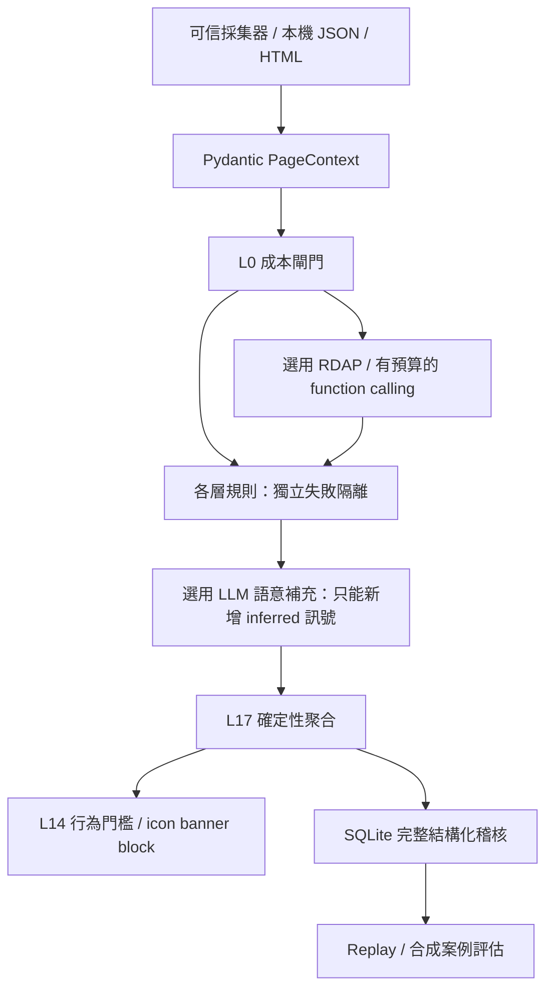

# 防詐腳本實作與技術說明

本版依原始架構討論完成可執行的 Python 驗證核心；原設計筆記已依要求刪除，實作以本文件為準。分支為 `codex/anti-scam-verification`。本次依使用者更新：L7 改為 LLM 靜態程式碼合理性審查，不需要執行 JavaScript；以下的「已實作」指腳本能力，不表示已完成 Chrome 擴充功能、雲端共享系統或隔離瀏覽器。

## 架構與判定



Python 3.12、Pydantic v2 定義所有資料邊界。CLI 最多讀取 2 MB；URL、文字、腳本、軌跡數量另有限制。各規則可獨立呼叫，`REGISTRY` 對應 L0–L16，L17 接收各層結果；CLI 也能選擇 L17。局部規則是輕量同步計算，遠端探測与選定的 LLM 分析透過 asyncio 扇出。任一層錯誤回 `unknown/error`，不抹除其他證據。

`LayerResult` 保留設計筆記的欄位，增加 `status`；每條 signal 自帶 `grade`、`weight`、`hard`，避免某層同時有 observed 與 inferred 時被一概當成強證據。頂層 `evidence_grade` 只作摘要。`confidence` 是啟發式顯示值，沒有經過機率校準。`clean` 不代表安全；未採集的資料維持 `unknown`，目前 `coverage` 固定為 `partial`。

L0 的 `skip` 只跳過遠端查詢與 LLM；本機規則仍執行，所以白名單也保留可疑訊號。本版不宣稱能達成「95% 不花 token」或「200ms 完整偵測」；需要真實流量量測。

L17 使用固定規則，沒有把最後放行權交給 LLM。分數按訊號 ID 去重、加總、封頂 100；只有一個具足夠權重的獨立層時最高 55。L10 社群指紋、L16 回報及 ADAPTIVE 不算可單獨支持封鎖的獨立證據。80 分以上或可信採集的硬證據會 block；35 分以上 banner；其餘 icon。15 分以上且不在人工信任清單時，敏感欄位 focus、submit、download_start 可觸發打斷。模型的訊號權重固定 10、永遠 inferred，不能單獨構成硬封鎖。

人工信任清單遵循原筆記：不打斷，但分數和訊號不隱藏。這會保留「已被入侵的白名單網站仍不攔截」的產品取捨，應由維護者定期檢查、移除失效項目。沒有將所有 `gov.tw` 一概放行。

## 逐檔功能與技術

下列路徑皆相對於專案根目錄。產生的 `.venv`、快取與套件 metadata 不屬於原始碼。

| 檔案 | 功能與運用技術 |
|---|---|
| `README.md` | 安裝、key 設定、CLI 與 Python 範例、重要限制。 |
| `pyproject.toml` | Python 版本、依賴、images/dev 選用套件、setuptools 封裝、scam-radar 入口、pytest 與 Ruff 設定。 |
| `uv.lock` | 鎖住解析後的依賴版本；使用 `uv sync --locked` 重建環境。 |
| `.gitignore` | 排除本機 key、環境、SQLite 資料與快取；保留可分享的空白設定範本。 |
| `.github/workflows/checks.yml` | Linux CI：安裝 lockfile、lint、格式檢查、單元測試與離線評估；不需要 API key。 |
| `config/config.example.json` | 可提交的空白設定，所有連網功能預設關閉。 |
| `config/config.local.json` | 本次建立供你填 key，Git 忽略、權限 600。新 clone 從 example 複製。 |
| `script/__init__.py` | 套件初始化；匯入不進行連線或寫檔。 |
| `script/config.py` | Pydantic Settings、SecretStr 避免 repr 顯示 key；環境變數可覆寫 key，限制預算與逾時。 |
| `script/models.py` | PageContext、NetworkEvent、Download、Signal、LayerResult、Decision、Analysis；拒絕未知欄位，限制輸入長度與 URL 格式。 |
| `script/domains.py` | urllib URL 解析、IDNA 正規化、PSL 註冊邊界與 PRIVATE 區段、完整標籤比對官方網域。 |
| `script/data/brands.json` | 可維護的機構別名與官方網域，含監理服務網、公路局及來源；作為套件資料一起封裝。 |
| `script/extract.py` | BeautifulSoup 靜態解析 title、可見文字、inline JS、敏感欄位種類、form action、簡單隱藏文字；不執行 JS、不擷取 input value。 |
| `script/layers/__init__.py` | 匯出 L0–L16 的 function registry。 |
| `script/layers/rules.py` | 每層 `verify_l0` 至 `verify_l16`、L0 gate、download helper；確定性規則、證據分級與可讀理由。各層詳見下一表。 |
| `script/layers/code_review.py` | L7 靜態 LLM 審查、strict CodeReview schema、片段索引驗證、固定回饋、低權重 inferred 結果。 |
| `script/layers/adjudication.py` | `adjudicate`、`verify_l17`、`should_interrupt`；訊號去重、硬規則名單、交叉佐證、白名單與行為門檻。 |
| `script/network.py` | 有大小與時間限制的 HTTP(S) GET，公網 IP 驗證、固定解析 IP、TLS SNI／憑證驗證、逐跳重新檢查轉址；不使用環境代理。 |
| `script/tools.py` | `VerificationTools` 的窄工具入口與相容別名、工具白名單／預算／失敗 unknown；RDAP、crt.sh、UA 探測及資料型工具。 |
| `script/images.py` | 本機 `decode_qr` 使用 zxing-cpp；`ocr_image` 使用 Pillow + pytesseract；有檔案／像素大小限制，OCR 限時 10 秒。 |
| `script/llm.py` | AsyncOpenAI Responses API、strict JSON schema、有限 reason code、台灣情境窄問題、每次分析的鎖與呼叫上限、逾時／錯誤降級、遮罩及上傳開關。 |
| `script/investigation.py` | `investigate` function-calling 迴圈；固定當前 ctx、空參數工具 schema、不重複調查、結構化 trace；模型看不到工具回傳的原始 HTML／JS。 |
| `script/pipeline.py` | `analyze` 串起本機層、可選查證、LLM、指紋／回報、額外規則、裁決與稽核，回完整 Analysis。SQLite 故障不阻止規則判定，以 audit_status/error 揭露。 |
| `script/storage.py` | SQLite 交易、參數化查詢、UUID audit、SHA-256 路徑與文字指紋、回報同意與去重、人工複核指紋、replay；DB 權限 600。 |
| `script/adaptive.py` | Pydantic 有限 DSL 的 `synthesize`、`detect`、`evaluate`、`promote`；不執行生成的 Python/JS，shadow 預設不影響風險，升版重算評估。 |
| `script/cli.py` | argparse 子命令 analyze/layer/tool/extract/replay，JSON I/O，錯誤訊息不輸出原始內容或 key。 |
| `script/evaluate.py` | 執行固定資料集，輸出 TP/FP/TN/FN、FPR、recall 及失敗案例；定義 suspicious 門檻為 35。 |
| `fixtures/government-phishing.json` | 仿冒監理站、催缴、站外表單與新網域的示範輸入；`.example` 保留域名。 |
| `fixtures/official-login.json` | 官方監理服務網 OTP 登入對照，驗證不因正常驗證碼欄位誤攔截。 |
| `fixtures/observed-exfiltration.json` | 三次敏感輸入隨鍵盤事件外傳的合成軌跡，示範硬證據。 |
| `fixtures/golden.json` | 15 正常／15 可疑的人工編寫合成案例，包含共享託管、新聞、防詐提醒、付款、QR、歷史表單與下載。 |
| `tests/test_rules.py` | 每層契約、網域偽裝／PSL、輸入拒絕、OTP／防詐文案、行為證據、QR／下載、抽取隱私。 |
| `tests/test_pipeline.py` | 三個 demo、錯誤隔離、無 key 降級、audit／回放、回報同意／去重、不靠社群單獨封鎖。 |
| `tests/test_tools.py` | 工具入口、預算、RDAP 解析、內網／混合 DNS／重新導向 SSRF 與固定 IP 連線測試。 |
| `tests/test_llm_adaptive.py` | mock Responses 契約、拒絕／錯誤降級、隱私開關、預算、planner 不讀原文、shadow／promote 與風險單調性。 |
| `tests/test_code_review.py` | L7 正常／可疑回饋、缺輸入／同意不呼叫、索引驗證與 pipeline 優先次序。 |
| `tests/test_evaluation.py` | 合成 golden set 的持續回歸檢查。 |
| `docs/IMPLEMENTATION.md` | 本文件：逐檔職責、技術選擇、接口、架設與未完成範圍。 |

## 每層驗證入口與實際範圍

L7 的 async 實作位於 `script.layers.code_review`，CLI layer L7 與完整 pipeline 都會呼叫它；同步 registry 中的 L7 僅回傳待審查狀態。其他 L0–L16 的公開 function 位於 `script.layers.rules`；接受 `PageContext`，回傳 `LayerResult`。資料未提供時不假裝已查證。L10/L16 的單層入口沒有資料庫時回 unknown，完整 pipeline 會以資料庫查詢補齊。

| 層／入口 | 本版實作 | 尚未涵蓋 |
|---|---|---|
| L0 `verify_l0` / `gate` | 官方清單、敏感欄位、跳轉、年齡、軌跡／下載等成本閘門 | Chrome session cache、真實流量成本統計 |
| L1 `verify_l1` | 轉址降級、跨站次數、IDN、弱 TLD 訊號、官方網域嵌入偽裝 | 編輯距離、混合字母系統、字形 pHash、主動追完整 JS 轉址 |
| L2 `verify_l2` | title／explicit claim 與官方名單比對；可用 LLM 補充身分語意 | favicon/DOM/CSS pHash、logo 截圖、銀行安控元件 |
| L3 `verify_l3` | 驗證碼轉交他人、遠端軟體指示、ATM、保證獲利、交通費用催促；LLM 補充 | session 多頁漏斗、可靠的全語境否定解析、完整詐騙分類 |
| L4 `verify_l4` | 可信敏感外傳軌跡、keyup 重複外傳、站外 form action、動態執行程式碼、可信金絲雀軌跡；LLM 程式審查移至 L7 | 瀏覽器 MAIN world instrumentation、執行任意腳本／反混淆引擎 |
| L5 `verify_l5` | 已提供或 RDAP 補回的註冊天數、已採集 TLS 驗證狀態 | ASN、MX、被動 DNS、JA4、批次 campaign 歸因 |
| L6 `verify_l6` | UA 回應文字的 SequenceMatcher 差異，低權重推測 | 地域出口、referer 探測、反向代理確證 |
| L7 `script.layers.code_review.verify_l7(ctx, llm)` | LLM 靜態審查程式合理性，輸出 concern 對應的 scripts 索引與中文 feedback；未執行 JS | 不提供動態外洩確證；缺 code／key／上傳許可時 unknown |
| L8 `verify_l8` | 提供歷史與目前欄位時檢查新增敏感表單 | Wayback 抓取、全頁歷史比對 |
| L9 `verify_l9` | 詞彙混用低權重規則；LLM 可補充 | 電話／地址資料庫、多語言全面判讀 |
| L10 `verify_l10` | pipeline 比對人工複核的 SHA-256 正規化文字指紋 | pHash、模糊相似、跨裝置同步、真正 campaign 歸因 |
| L11 `verify_l11` | 採集器回傳 missing_business_pages 時給弱訊號 | 公司登記／金融許可查證、全站爬取 |
| L12 `verify_l12` | 執行檔、雙副檔名、RTL、PDF magic bytes、站外／自動下載 | 解壓縮、完整 MIME 嗅探、防毒引擎、Chrome 下載攔截 |
| L13 `verify_l13` | 解碼後 URL 重跑 L1、站外 QR、付款／通訊 scheme；獨立本機圖片 decoder | 圖片來源採集、canvas 讀取、完整 QR 網頁深度分析 |
| L14 `verify_l14` / `should_interrupt` | deterministic 行為閾值、三種 display level 的資料契約 | 實際 icon/banner/block 前端與狀態儲存 |
| L15 `verify_l15` | 隱藏指令文字、已提供的延遲敏感欄位旗標；LLM 可補充 | MutationObserver、shadow DOM、視覺隱藏完整判斷 |
| L16 `verify_l16` | 本機 opt-in 回報、去重計數、每次完整結果存檔 | 共享 API、登入驗證、跨裝置率限、背景重播佇列 |
| L17 `verify_l17(ctx, layers)` | 結構化、確定性裁決與理由，不允許模型改硬規則 | LLM 自由跨訊號裁決刻意不採用 |

LLM 類別另提供 L6/L8/L11 的窄問題分析入口；預設 pipeline 只依 L7、L2、L3、L1、L15、L9 順序選擇預算內的層。`--deep` 規劃與內容分析共用 `max_llm_calls`，調查至少保留一個 LLM call 給 L7；其餘內容分析依剩餘預算執行。

幾個必要修正：正常 OTP 欄位、第三方支付、Service Worker、新 TLS 憑證、簡體字或 RWD 差異均不能單獨當詐騙確證。本版的硬規則只接受可信採集器提供的觀測外洩。標題提及機構仍可能是新聞，L2 本身是 inferred；名單不完整時不代表其他政府服務是假站。

## 查證工具與相容入口

呼叫方式：`await VerificationTools(settings, store).call(name, ctx)`；工具也各有同名 async method。透過 `.call` 才有工具白名單、計數上限及統一錯誤處理。直接 method 適合內部組合，但由呼叫端負責總預算。

| 工具 | 實際行為與回傳 |
|---|---|
| `rdap_lookup` | 查 RDAP.org，再隨轉址查註冊局；抽 registration date 算 domain_age_days。查不到／被率限／國碼網域未提供時 unknown。共享平台租戶不是獨立註冊網域，可能查不到，不以平台成立日期假裝租戶年齡。 |
| `crt_sh_search` | 對當前 host 查 crt.sh JSON，最多處理 200 筆／100 個名稱；只回關聯，不把同張憑證當詐騙證據。 |
| `fetch_script` | GET 當前頁面，抽 inline scripts；不任意遞迴抓所有外連 JS，也不讓模型選 URL。 |
| `probe_with_ua` | 三種 UA 並行 GET；至少兩筆成功才比較。每個 GET 有独立資源限制，整組計為一次工具呼叫。 |
| `code_review` / `sandbox_replay` | LLM 靜態審查 scripts；sandbox_replay 僅保留為相容別名。mode 為 llm_static_code_review，不啟動瀏覽器。 |
| `wayback_diff` | 驗證提供的前後欄位快照；工具名稱沿用設計，不宣稱已向 Wayback 取得資料。 |
| `query_fingerprint_db` | 本機 SQLite 人工複核指紋 exact match；對 planner 只提供 matched。 |
| `psl_resolve` | host 與包含 PRIVATE 區段的註冊邊界，完全離線。 |
| `ocr_image` | 統一 ctx 工具入口因沒有圖片輸入而回 unknown；真正 OCR 使用 `script.images.ocr_image(path)`，不交給 LLM 選本機檔案。 |

圖片選用功能安裝：`uv sync --locked --extra images`。OCR 另需系統 Tesseract 與 `chi_tra` / `eng` 語言資料；QR 不依賴 Tesseract。未安裝選用依賴時，圖片 function 會出現 ImportError，核心分析不受影響。圖片功能本次尚未做實機驗證。

## LLM 與自適應規則

OpenAI Responses API 使用 strict JSON schema，拒絕不完整／不符合 schema 的結果；API 重試關閉以維持明確呼叫上限，錯誤保留既有規則結果。`store=False` 關閉 Response 儲存要求，並不等同於供應商的全面零保留承諾。key 不會寫入分析輸出、稽核或錯誤訊息。

內容層的模型只可回列舉 reason code，程式轉成固定中文說明。這避免自由文字被洗入 planner 或 audit。此限制降低 prompt injection 的傳播面，但不保證語意模型完全不受騙。planner 只讀 layer ID、signal ID、分數、status 與有限數字；工具參數固定空物件，目標固定為當前 ctx。`investigation_trace` 保留工具名稱與結果狀態，實際脚本不會進入 planner 後續訊息。

`script.adaptive.synthesize` 只產有限 DSL：選擇指定計數特徵、最低門檻、最多 20 分。永不 eval／exec 模型產物。新規則強制 shadow，`detect(rule, ctx)` 不影響判定；可用 `shadow=True` 評估。`promote` 重算至少 15 正常＋15 可疑案例、FPR=0、recall≥0.5，且需呼叫端明示 `reviewed=True`。這是開發流程的人工審查欄位，不是多使用者權限系統。active 規則透過 `analyze(..., detectors=[rule])` 加入；停用為 disabled。provenance 保留於 rule 物件；目前沒有自動下發、簽章、版本資料庫或衰退排程。

## 資料契約與隱私

外部採集器應只輸入欄位種類與布林證據，不能把使用者實際填入的密碼、OTP、卡號、cookies 或 request body 傳進來。`observed`、`sensitive_data`、`canary_detected`、`authorized_destination` 必須由可信採集器建立，不能讓被分析頁面或 LLM 自己宣稱。CLI JSON 視為由操作人提供的測試資料；如果日後建立公開 API，不能直接信任網頁 postMessage 的這些欄位。

稽核記錄包含完整的 Analysis 結構化結果與 path SHA-256，不含原始頁面、完整 URL、query、fragment、表單值、原始腳本。SHA-256 是去識別化索引，不是加密，低熵路徑仍可能被猜到。SQLite 是本機檔案，回報不會自動上傳到共享服務；reporter_hash 需由未來的認證後端核發，現在的本機去重不能防止 Sybil 攻擊。

```python
from script.storage import Store, fingerprint

store = Store("var/radar.sqlite3")
store.report("https://suspect.example/a?token=secret", "template text",
             fingerprint("demo-reporter"), consent=True)
# 只能由人工複核流程呼叫，使用者回報不會自動進這個表。
store.add_reviewed_fingerprint("template text", "review-ticket-001")
```

所有正常 analysis 預設都記 audit，不需等使用者回報。輸出的 audit_id 可用 `uv run scam-radar replay AUDIT_ID` 讀回当時完整結果；這個命令不重跑網頁、也不呼叫 LLM。資料庫不可寫時仍提供判定，audit_status 會是 error；此時沒有可回放記錄。開發者呼叫 Store 的低階方法需自行處理 I/O 例外。

## 架設方式與邊界

黑客松先用單機後端 worker／CLI 即可：Linux 或 macOS、Python 3.12、`uv sync --locked`；只執行本機資料示範時，不需要外部服務。設定檔、資料库放在只有執行帳號可讀寫的位置，使用專案根目錄作為工作目錄。套件可打 wheel，品牌資料已包含在封裝內，CLI 的範例與設定路徑則相對於工作目錄。

本版沒有開任何 HTTP port，沒有冒充已完成的部署網址。接擴充功能時，應由認證 API 驗證請求大小與來源、按使用者／目的站率限，再排入固定大小的工作佇列；快路徑先顯示、慢路徑完成後更新。前端使用 `display_level`、`interrupt_triggers`、`interrupted`，popup 顯示全部 layers/signals。L0 session cache 應以導覽／採集版本失效，不能永久以整個網域快取安全結果。

查證 HTTP 僅允許 http/https 的 80/443 port，拒絕 URL credentials、控制字元和反斜線；DNS 全部解析結果都需公網，直接連接已驗證 IP，TLS 保留正確 hostname 驗證。每跳 redirect 重新檢查，不帶 cookies／授權 headers；最多五次轉址、限制回應大小、拒絕壓縮。只有 GET，沒有表單送出或下載檔案執行。GET 仍可能帶來站方流量或 query 副作用，正式環境應另用固定 egress 與工作佇列的全域預算。

Python 系統 DNS resolver 可能超過 socket deadline，取消 asyncio.to_thread 也不能殺死已開始的工作。本版的 timeout 是應用層限制，不能取代作業系統的資源隔離；公開 worker 應跑在可終止的子程序／容器，配置硬時間、記憶體與 egress 限制。不要把此 CLI 當作無限併發的公網代理。

L7 現在只呼叫 LLM 靜態審查，不需要沙箱或瀏覽器。`feedback` 使用固定 concern 對應的中文建議，附 scripts 的零起算索引，避免把腳本中的文字或私密值回寫到 audit。所有訊號均 inferred、最多加 10 分，不能單獨封鎖。既有可信金絲雀軌跡驗證移至 L4。L7 的缺 key、錯誤 JSON 或無效 scripts 索引都回 unknown；上傳關閉回 skipped。

本版不含 pHash、Wayback 抓取、跨裝置同步、簽章規則下發、自主紅藍對抗；這些是有明確入口可接的下一階段，不把回 unknown 的 adapter 包裝成已完成服務。

## 驗證與參考資料

執行 `uv run pytest -q`、`uv run ruff check script tests`、`uv run ruff format --check script tests`、`uv run python -m script.evaluate`。合成資料預期 15 TP / 15 TN / 0 FP / 0 FN，代表這批固定案例沒有回歸，不代表真實環境 100% 準確。尚需蒐集取得同意、人工標註且去識別化的真實案例；應把訓練／規則設計樣本與留出測試集分開。

本次沒有 API key，OpenAI 路徑以 mock 測試，不宣稱已驗證實際帳號模型權限、延遲、費用或真實模型準確率。RDAP／crt.sh／主動探測也以本機 mock 驗證契約；沒有對可疑站執行動態互動。

官方 API 的 Structured Outputs 與 function calling 實作依據：[Structured Outputs](https://developers.openai.com/api/docs/guides/structured-outputs)、[Function calling](https://developers.openai.com/api/docs/guides/function-calling)。預設模型能力參照 [GPT-5.4 mini](https://developers.openai.com/api/docs/models/gpt-5.4-mini)。

可歸責網域邊界依 [Public Suffix List](https://publicsuffix.org/list/)；採用 tldextract 內建快照，固定 lockfile 可重現，升級依賴時需重跑共享託管案例。RDAP.org 的轉址及錯誤處理依 [RDAP.org 文件](https://about.rdap.org/)，不是假設每個國碼網域都有可用註冊日期。

政府品牌參照 [監理服務網](https://www.mvdis.gov.tw/?force=web) 與 [交通部公路局](https://www.thb.gov.tw/)。名單中的防詐公告來源保留於 JSON，方便人工維護；本版只維護這兩個相關機構，不宣稱涵蓋所有台灣政府服務。

本次本機驗證紀錄（2026-09-12）：81 項 pytest 通過，Ruff lint／format 檢查通過，三個 demo 情境通過，wheel 封裝成功且包含品牌資料。這些檢查均未使用真實 API key。
